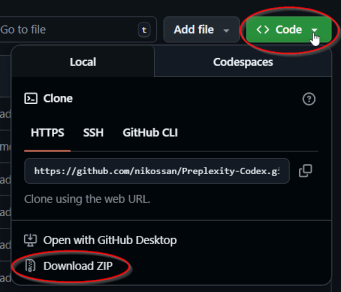
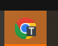

## Perplexity doesn’t let you properly export everything — so I built this free tool!

**Perplex-Codex**:
 - **Automatically gets** your conversations **and the AI generated files** from Perplexity by simulating a human using a browser.
 - Index, view and search  your exported conversations. 

Note
In a way it is even better. The issue is that Perplexity does not load long conversations fully in your web browser. In order to reliably search in such long conversations, you need to scroll down page by page to load it fully.

## Get **your data** before Perplexity changes something!

## Installation 
1. Downlaod the source as a zip file
   
   
3. Create a folder on your PC
4. Extract the Preplex-Codex-main.zip file there
5. If you are using Windows, run `setup.bat` in a terminal (cmd or powershell), in the folder where you extracted Preplex-Codex-main.zip.
If you are using Linux, run `setup.sh` in a terminal in the directory.

## How to use it
The setup will launch a web page with the full interface and the following guide included:

1.  **Launch**: Run `npm start` in your terminal (cmd or powershell). Do it in the folder/directory where you installed **Perplex-Codex**. This starts the server (http://localhost:3000/viewer.html) and **automatically opens the viewer** in your browser.

2.  **⚙️ Settings** - configure before the first run! 
	- **Login**: Enter your email. This will be used automatically by the auto-browser engine. **This is a must!** The rest you can leave as defaults.
	- **Keep Browser Open** - Keep the auto-browser open to avoid re-logging. 
	- **Inactivity Timeout**  - timeout to close the browser. This is to avoid keeping your login/session for too long and get it in a strange state from Perplexity point of view.
	- **Min Delay** and **Max Delay**: Random delay between saving each conversation  to avoid rate limits by Perplexity. So far, the defaults are not causing a problem.
	- **Batch size**: Again, a way to keep the load and triggers happy at Perplexity. The tool will pull the set amount of conversations and stop. To get the next batch you need to manually import them again. So far, few hundreds are not causing a problem.
	- **Library scan optimisation**: decides  how extensive the list of the scanned conversations to be. Full scan will get all of your Library titles. You should do that once. Then use the scan of the top conversations to get only the changed ones. No matter the depth of the scan, the number of downloaded conversations is determined by the Batch Size. 
3.  **🚀 Start Auto Import** 
	- This will get all **new** conversations from Perplexity. The tool will take also the files generated by Perplexity. The pulled files will be in the sub-folder "export/". **NB!** The extraction depends on the Batch Size and Scanning depth! If you want it all in one shot, set to Full Scan, and Batch Size to 10000, for example (or higher than what you have in your Library). 
	- **Very important!** The auto-browsing engine will start in the background. Check the task bar for a flashing Chrome icon with a "T" on it. 
	
	
	- Click it and **wait** until a **confirmation code screen** is shown. Don't try to take over, to enter your e-mail, or click on anything. 
	- Your only job is: **Wait! Check your e-mail! Enter the verification code** you will get from Perplexity. 
	- After that leave this browser alone! Don't touch it, don't close it! (Don't like, don't subscribe!) 
	- You can switch to another app and leave it in the background. 
4.  **Search**: Use the sidebar to search all exported content. It is indexed and full-text auto search is enabled. 
5. Sort by Newest/Oldest - same as in Perplexity history. 
6. Click on an article to view. You can see the source text of the markdown file or the on-line version of it - see the buttons at the top right.
7. **🧠 Re-index Library**. When your work inside perplexity on old conversations and download them, you need to re-index for the search to work well.
8. Once you are done, close the server by going to the terminal where you started it and press **Ctrl+C** 2 times. This will also close this page.

## Support and discussions 

https://www.reddit.com/r/PerplexCodex/

### *Note* 

At present, even the native Perplexity tools sometimes fail to export a thread properly and the initial prompt is lost. Or generated files are missing. This happens usually if the prompt and/or the conversation are very long (>100k as markdown file). Therefore, the import might not be 100% perfect. I have tested the import with conversations that were 400k and had dozen of generated files. I downloaded 1000+ conversations multiple times too. But I cannot guarantee it will work always all the time.  In the future, Perplexity might change the way it displays the conversations too. Then an update might be needed, so <a href="https://ko-fi.com/niko256238" target="_blank" class="kofi-link">
                    ☕ Buy me a cappuccino! It keeps the updates brewing!☕
                </a>

### DISCLAIMER: 

THE SOFTWARE IS PROVIDED "AS IS", WITHOUT WARRANTY OF ANY KIND, EXPRESS OR
IMPLIED, INCLUDING BUT NOT LIMITED TO THE WARRANTIES OF MERCHANTABILITY,
FITNESS FOR A PARTICULAR PURPOSE AND NONINFRINGEMENT. IN NO EVENT SHALL THE
AUTHORS OR COPYRIGHT HOLDERS BE LIABLE FOR ANY CLAIM, DAMAGES OR OTHER
LIABILITY, WHETHER IN AN ACTION OF CONTRACT, TORT OR OTHERWISE, ARISING FROM,
OUT OF OR IN CONNECTION WITH THE SOFTWARE OR THE USE OR OTHER DEALINGS IN THE
SOFTWARE.
